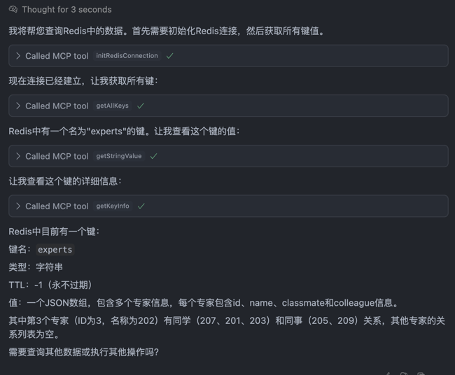
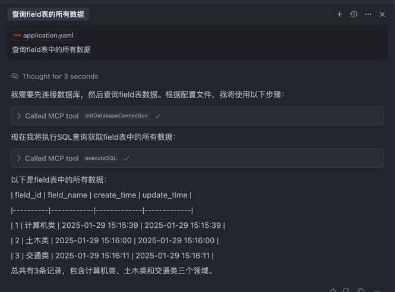

# 在项目中快速通过ai来实现mysql、redis（等后续补充）的增删改查
## 功能
- 数据库增删改查
- redis增删改查
- 查询出结果后，快速实现模版代码（自定义配置rulers）

### 项目运行所必要环境
 - java环境java21（spring-ai要求）
 - maven环境配置3.9.5（与java21适配）

### 运行
- 本地运行命令
  `mvn clean install`
  拿到jar包的绝对地址路径
- cursor中引入mcp
#### 
    "名称": {
      "command": "java",
      "args": [
        "-Dspring.ai.mcp.server.stdio=true",
        "-Dspring.main.web-application-type=none",
        "-Dlogging.pattern.console=",
        "-jar",
        "jar包地址"
      ]
    }
### 

### 具体功能展示 

